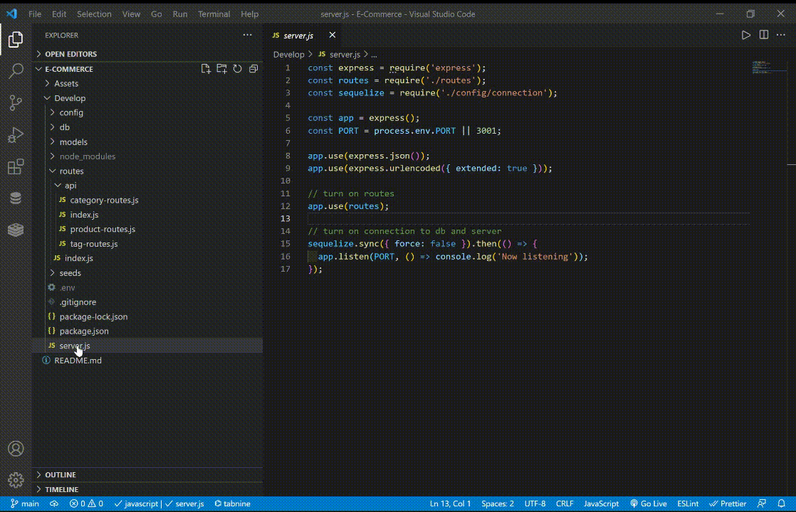

# Back-End E-Commerce RESTful API

## Table of Contents

- [Description](#description-)
- [Licenses](#licenses-)
- [Installation](#installation-)
- [Usage](#usage-)
- [Technologies](#technologies-)
- [Demo Videos](#demo-videos-)
- [Credits](#credits-)
- [Contributions](#contributions-)
- [Questions](#questions-)


## Description : 
This is a Back-End base for an E-Commerce website, based on RESTful API that was created using the Sequelize promise-based Node.js ORM for MySql. Users can Create, Read, Update and Delete data from the database. There are four models built in the app Categories, Products, Tags, and ProductTags that have relationships such as one-to-many relationships and many-to-many relationships.

## Licenses :
[](https://opensource.org/licenses/MIT)


## Installation : 
To install the Back-End E-Commerce RESTful API App use the instructions bellow &#8595;
```
npm install

mysql -u root -password

     source db/schema.sql

     quit

npm run seed 

npm run start

```


## Usage : 

After installation users need to create a database by running `mysql -u root -password` and entering the mysql password, after that users need to run the `source db/schema.sql` command to create the database. After exiting the mysql users need to crete a `.env` file to store the environment variables. To seed the database users need to run the `npm run seed ` command then users can run the server by using the `npm run start`. To make requests for testing users can use any of the RESTful API clients like Postman and Insomnia. 


## Technologies : 

-  Javascript.
-  Node.js.
-  Express.js.
-  SQL.
-  MySQL.
-  Sequelize.
-  Mysql2 npm package.
-  Dotenv.

## Demo Videos : 
### Here are demo videos of my deployed Back-End E-Commerce RESTfull API App      



## Credits :

- [Muiasar-Al-Ani](https://github.com/Muiasar-Al-Ani)


## Contributions :
    Contributions, issues, and feature requests are welcome!
    Give a ⭐️ if you like this project!


## Questions : 
If you have any Question please feel free to contact me:
- muiasar2012@gmail.com
- [Muiasar-Al-Ani](https://github.com/Muiasar-Al-Ani)


&copy; 2021 [Back-End E-Commerce RESTfull API](https://github.com/Muiasar-Al-Ani)
